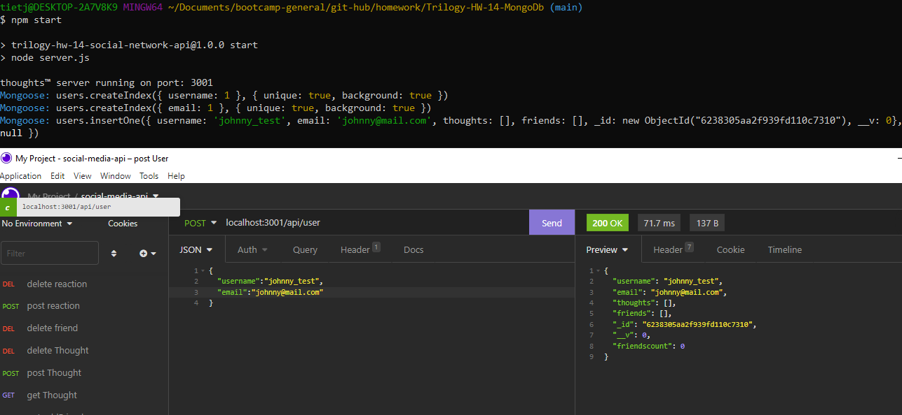

# Thoughts - Social Network API

Thoughts is a basic back-end API for a social network utilizing express and MongoDB via Mongoose.

The API allows for: 
- Creating users, updating user information, adding and removing users to and from friends lists.
- Posting 'thoughts', updating thoughts, removing thoughts as well as adding and removing 'reactions' to thoughts.
- Removing a user account also purges that users 'thoughts' from the database.
## Authors
- [@charlestietjen](https://www.github.com/charlestietjen)
## License

[MIT](https://choosealicense.com/licenses/mit/)


## Screenshots



## Video

[](https://youtu.be/5-DyZC5wlUo)

## Installation

To install the application locally, run:

```bash
'npm i'
``` 
This will install all dependencies required to run the application.

Required modules can be reviewed in the package.json.
## Run Locally

Lastly run the server with:

```bash
npm start
```

Navigate to either http://localhost:3001/ if running locally, or the domain and port the application is listening on. 